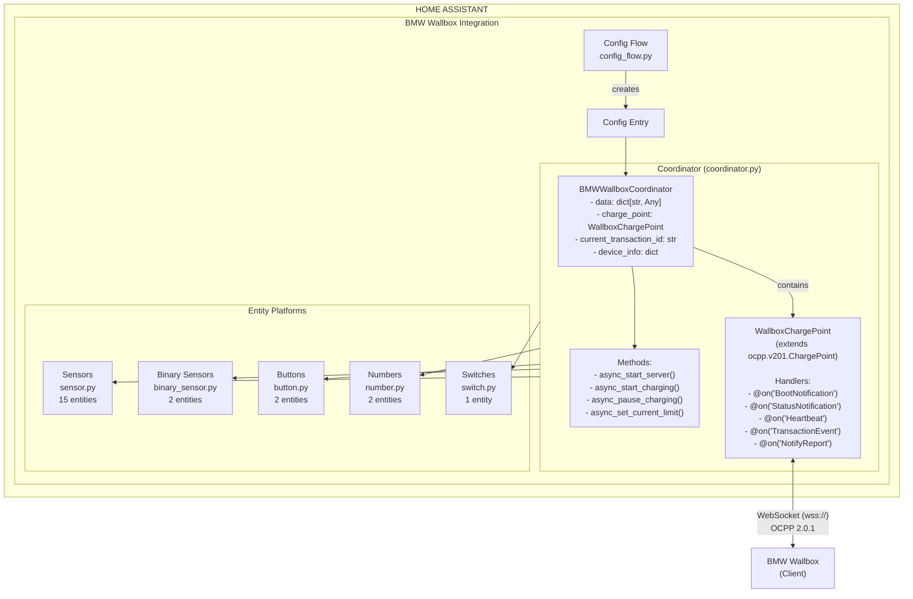
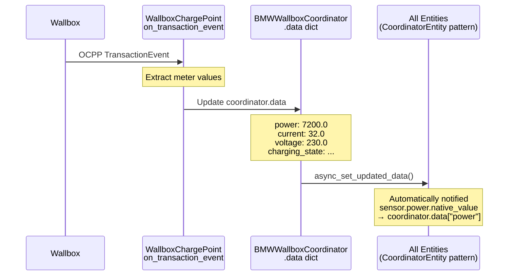
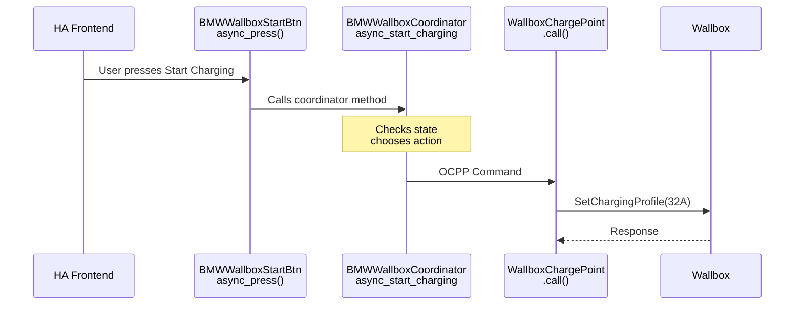
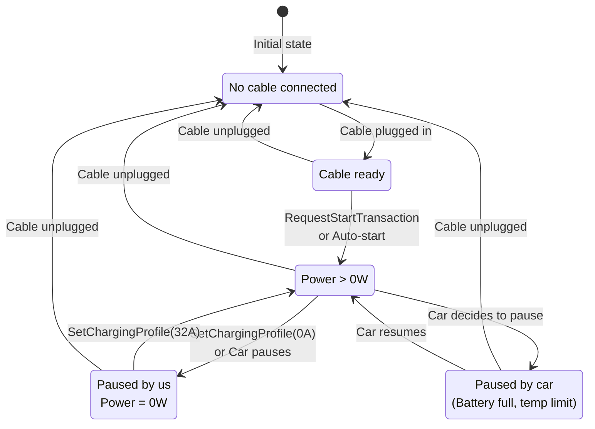
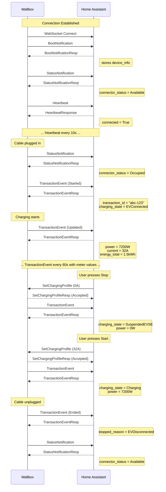
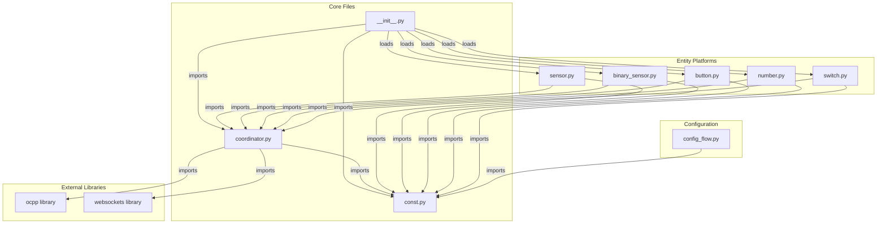

# BMW Wallbox Integration - System Architecture

## Component Overview



---

## Class Hierarchy

```mermaid
classDiagram
    direction TB
    
    class DataUpdateCoordinator {
        <<Home Assistant>>
    }
    class BMWWallboxCoordinator {
        +data: dict
        +charge_point: WallboxChargePoint
    }
    class WallboxChargePoint {
        +id: str
        +coordinator: BMWWallboxCoordinator
    }
    class ChargePoint {
        <<ocpp.v201>>
    }
    
    DataUpdateCoordinator <|-- BMWWallboxCoordinator
    BMWWallboxCoordinator *-- WallboxChargePoint
    ChargePoint <|-- WallboxChargePoint
    
    class CoordinatorEntity {
        <<Home Assistant>>
    }
    class SensorEntity
    class BinarySensorEntity
    class ButtonEntity
    class NumberEntity
    class SwitchEntity
    
    class BMWWallboxSensorBase
    class BMWWallboxStatusSensor
    class BMWWallboxPowerSensor
    class BMWWallboxEnergyTotalSensor
    class BMWWallboxCurrentSensor
    class BMWWallboxVoltageSensor
    
    class BMWWallboxBinarySensorBase
    class BMWWallboxChargingBinarySensor
    class BMWWallboxConnectedBinarySensor
    
    class BMWWallboxButtonBase
    class BMWWallboxStartButton
    class BMWWallboxStopButton
    
    class BMWWallboxCurrentLimitNumber
    class BMWWallboxLEDBrightnessNumber
    
    class BMWWallboxChargingSwitch
    
    CoordinatorEntity <|-- SensorEntity
    CoordinatorEntity <|-- BinarySensorEntity
    CoordinatorEntity <|-- ButtonEntity
    CoordinatorEntity <|-- NumberEntity
    CoordinatorEntity <|-- SwitchEntity
    
    SensorEntity <|-- BMWWallboxSensorBase
    BMWWallboxSensorBase <|-- BMWWallboxStatusSensor
    BMWWallboxSensorBase <|-- BMWWallboxPowerSensor
    BMWWallboxSensorBase <|-- BMWWallboxEnergyTotalSensor
    BMWWallboxSensorBase <|-- BMWWallboxCurrentSensor
    BMWWallboxSensorBase <|-- BMWWallboxVoltageSensor
    
    BinarySensorEntity <|-- BMWWallboxBinarySensorBase
    BMWWallboxBinarySensorBase <|-- BMWWallboxChargingBinarySensor
    BMWWallboxBinarySensorBase <|-- BMWWallboxConnectedBinarySensor
    
    ButtonEntity <|-- BMWWallboxButtonBase
    BMWWallboxButtonBase <|-- BMWWallboxStartButton
    BMWWallboxButtonBase <|-- BMWWallboxStopButton
    
    NumberEntity <|-- BMWWallboxCurrentLimitNumber
    NumberEntity <|-- BMWWallboxLEDBrightnessNumber
    
    SwitchEntity <|-- BMWWallboxChargingSwitch
```



---

## Data Flow

### 1. Incoming Data (Wallbox → Home Assistant)



### 2. Outgoing Commands (Home Assistant → Wallbox)



---

## Charging State Machine



---

## OCPP Message Flow

### Normal Charging Session



---

## Async Model

### WebSocket Server

```python
# coordinator.py - async_start_server()

# 1. Create SSL context
ssl_context = ssl.SSLContext(ssl.PROTOCOL_TLS_SERVER)
ssl_context.load_cert_chain(cert_path, key_path)

# 2. Start WebSocket server (runs in background)
self.server = await websockets.serve(
    on_connect,           # Handler for new connections
    "0.0.0.0",            # Listen on all interfaces
    self.config["port"],  # Default: 9000
    subprotocols=["ocpp2.0.1"],
    ssl=ssl_context,
)

# 3. on_connect creates WallboxChargePoint and starts message loop
async def on_connect(websocket):
    self.charge_point = WallboxChargePoint(id, websocket, self)
    await self.charge_point.start()  # Blocks, processes messages
```

### Entity Updates

```python
# Entities extend CoordinatorEntity which handles automatic updates

class BMWWallboxPowerSensor(CoordinatorEntity, SensorEntity):
    @property
    def native_value(self) -> float | None:
        # Called automatically when coordinator.data updates
        return self.coordinator.data.get("power")

# In coordinator, after processing OCPP message:
self.data["power"] = new_value
self.async_set_updated_data(self.data)  # Triggers all entity updates
```

---

## File Dependencies


