# BMW Wallbox Integration - Coordinator API Reference

## Overview

The coordinator (`coordinator.py`) contains two main classes:

1. **`BMWWallboxCoordinator`** - Home Assistant DataUpdateCoordinator that manages the OCPP server and exposes charging control methods
2. **`WallboxChargePoint`** - OCPP ChargePoint handler that processes incoming messages

---

## BMWWallboxCoordinator

**Location:** `coordinator.py:239-886`

**Extends:** `homeassistant.helpers.update_coordinator.DataUpdateCoordinator`

### Constructor

```python
def __init__(
    self,
    hass: HomeAssistant,
    config: dict[str, Any],
) -> None:
```

**Parameters:**
- `hass` - Home Assistant instance
- `config` - Configuration from config entry (`entry.data`)

### Properties

| Property | Type | Description |
|----------|------|-------------|
| `data` | `dict[str, Any]` | All sensor data (see `DATA_SCHEMAS.md`) |
| `config` | `dict[str, Any]` | Configuration from config entry |
| `server` | `websockets.WebSocketServer` | WebSocket server instance |
| `charge_point` | `WallboxChargePoint \| None` | Connected charge point handler |
| `current_transaction_id` | `str \| None` | Active transaction UUID |
| `device_info` | `dict[str, Any]` | Device info from BootNotification |

---

## Server Lifecycle Methods

### async_start_server

**Location:** `coordinator.py:316-354`

```python
async def async_start_server(self) -> None:
    """Start the OCPP WebSocket server."""
```

**Purpose:** Starts the WSS (WebSocket Secure) server for OCPP communication.

**Called from:** `__init__.py:async_setup_entry()`

**Behavior:**
1. Creates SSL context from configured certificate files
2. Starts WebSocket server on configured port (default 9000)
3. Registers `on_connect` handler for new connections
4. Server runs in background, handles multiple connections

**Raises:** `ConfigEntryNotReady` if server fails to start

**Example:**
```python
coordinator = BMWWallboxCoordinator(hass, entry.data)
await coordinator.async_start_server()  # May raise ConfigEntryNotReady
```

---

### async_stop_server

**Location:** `coordinator.py:356-361`

```python
async def async_stop_server(self) -> None:
    """Stop the OCPP server."""
```

**Purpose:** Cleanly shuts down the WebSocket server.

**Called from:** `__init__.py:async_unload_entry()`

**Example:**
```python
await coordinator.async_stop_server()
```

---

## Charging Control Methods

### async_start_charging

**Location:** `coordinator.py:616-805`

```python
async def async_start_charging(self, status_callback=None, allow_nuke: bool = True) -> dict:
    """Start/resume charging using SetChargingProfile(32A)."""
```

**Purpose:** Intelligent start that chooses the right approach based on current state.

**Parameters:**
- `status_callback` - Optional async callback for progress updates
- `allow_nuke` - If True (default), will reboot wallbox as last resort if all else fails

**Returns:**
```python
{
    "success": bool,    # True if charging started/resumed
    "message": str,     # User-friendly message
    "action": str,      # "started", "resumed", "already_charging", "rejected", "nuked", "failed"
}
```

**Logic Flow:**

```mermaid
flowchart TD
    Start([async_start_charging called])
    CheckConn{Is wallbox<br/>connected?}
    FailNotConn[Return failure:<br/>'Not connected']
    CheckPower{Already charging?<br/>power > 0}
    SuccessAlready[Return 'already_charging']
    CheckTx{Has active<br/>transaction?}
    TryResume[Try SetChargingProfile 32A<br/>to resume]
    ResumeOK{Resume<br/>succeeded?}
    SuccessResume[Return 'resumed']
    TryStart[Try RequestStartTransaction<br/>+ SetChargingProfile 32A]
    StartOK{Start<br/>succeeded?}
    SuccessStart[Return 'started']
    CheckNuke{allow_nuke<br/>= True?}
    Nuke["💣 NUKE: Reset(Immediate)<br/>Wallbox reboots ~60s"]
    SuccessNuke[Return 'nuked']
    FailAll[Return 'failed']
    
    Start --> CheckConn
    CheckConn -->|NO| FailNotConn
    CheckConn -->|YES| CheckPower
    CheckPower -->|YES| SuccessAlready
    CheckPower -->|NO| CheckTx
    CheckTx -->|YES| TryResume
    CheckTx -->|NO| TryStart
    TryResume --> ResumeOK
    ResumeOK -->|YES| SuccessResume
    ResumeOK -->|NO| TryStart
    TryStart --> StartOK
    StartOK -->|YES| SuccessStart
    StartOK -->|NO| CheckNuke
    CheckNuke -->|YES| Nuke
    CheckNuke -->|NO| FailAll
    Nuke --> SuccessNuke
```



**Example:**
```python
# Normal start (with NUKE fallback)
result = await coordinator.async_start_charging()

# Start without NUKE fallback (won't reboot if all fails)
result = await coordinator.async_start_charging(allow_nuke=False)

if result["success"]:
    if result["action"] == "nuked":
        print("Wallbox rebooting, charging will auto-start in ~60s")
    else:
        print(f"Charging started: {result['action']}")
else:
    print(f"Failed: {result['message']}")
```

**💣 NUKE Option:**
The NUKE is a last resort when all start methods fail. It reboots the wallbox,
which clears any stuck states. After reboot (~60 seconds), charging auto-starts
if the cable is plugged in. Use with caution!

---

### async_stop_charging

**Location:** `coordinator.py:745-757`

```python
async def async_stop_charging(self) -> dict:
    """Stop charging - uses EVCC-style pause (SetChargingProfile 0A)."""
```

**Purpose:** Pauses charging without ending the transaction. **Calls `async_pause_charging()` internally.**

**Returns:** Same as `async_pause_charging()`

**Why pause instead of stop:**
- `RequestStopTransaction` ends the transaction and can cause stuck states
- `SetChargingProfile(0A)` pauses but keeps transaction alive
- User can resume instantly with `async_start_charging()`
- No wallbox reset needed

---

### async_pause_charging

**Location:** `coordinator.py:589-669`

```python
async def async_pause_charging(self) -> dict:
    """Pause charging via SetChargingProfile(0A) - EVCC-style."""
```

**Purpose:** Pauses charging by setting current limit to 0A.

**Requirements:**
- Wallbox must be connected (`self.charge_point` exists)
- Active transaction must exist (`self.current_transaction_id`)

**Returns:**
```python
{
    "success": bool,
    "message": str,  # "Charging paused - press Start to resume" or error
}
```

**Example:**
```python
result = await coordinator.async_pause_charging()
if result["success"]:
    # Charging is paused, can resume with async_start_charging()
    pass
```

---

### async_resume_charging

**Location:** `coordinator.py:671-743`

```python
async def async_resume_charging(self, current_limit: float | None = None) -> dict:
    """Resume charging via SetChargingProfile - EVCC-style."""
```

**Purpose:** Resumes paused charging by setting current limit.

**Parameters:**
- `current_limit` - Target current in Amps (optional). If not specified, uses the tracked user preference from `coordinator.data["current_limit"]`.

**Requirements:**
- Wallbox must be connected
- Active transaction must exist

**Returns:**
```python
{
    "success": bool,
    "message": str,  # "Charging resumed at 32A" or error
}
```

**Example:**
```python
# Resume with user's preferred current limit (from slider)
result = await coordinator.async_resume_charging()

# Resume with specific current limit
result = await coordinator.async_resume_charging(16.0)  # Resume at 16A
```

---

### async_set_current_limit

**Location:** `coordinator.py:759-832`

```python
async def async_set_current_limit(self, limit: float) -> bool:
    """Set charging current limit via SetChargingProfile."""
```

**Purpose:** Dynamically adjust charging current.

**Parameters:**
- `limit` - Current in Amps (0 = pause, max = full speed)

**Requirements:**
- **Active transaction required** - this only works during charging
- Wallbox must be connected

**Returns:** `True` if accepted, `False` otherwise

**Behavior:**
- Sends `SetChargingProfile` to wallbox
- If accepted, stores the value in `coordinator.data["current_limit"]`
- The stored value is used by `async_start_charging()` and `async_resume_charging()`

**Example:**
```python
# Dynamic current limiting based on solar production
available_amps = calculate_available_current()
success = await coordinator.async_set_current_limit(available_amps)
# If successful, coordinator.data["current_limit"] is automatically updated
```

**Important Notes:**
- Does NOT work without an active transaction
- Use for solar charging, load balancing, etc.
- Value is applied immediately and remembered for future start/resume operations

---

## Wallbox Management Methods

### async_reset_wallbox

**Location:** `coordinator.py:471-524`

```python
async def async_reset_wallbox(self, status_callback=None) -> dict:
    """Reset the wallbox to clear stuck transaction state."""
```

**Purpose:** Reboots the wallbox. Use to recover from stuck states.

**Parameters:**
- `status_callback` - Optional async callback for progress updates

**Returns:**
```python
{
    "success": bool,
    "message": str,  # "Reset accepted - wallbox is rebooting (~60 seconds)"
    "action": "reset",
}
```

**Behavior:**
1. Sends `Reset(Immediate)` command
2. Wallbox reboots (~60 seconds)
3. Marks `connected = False`
4. Clears `current_transaction_id`
5. After reboot, wallbox reconnects and may auto-start if cable is plugged

---

### async_start_charging_with_reset

**Location:** `coordinator.py:526-587`

```python
async def async_start_charging_with_reset(self, status_callback=None) -> dict:
    """Full start sequence - resets if needed, waits, then starts."""
```

**Purpose:** Complete recovery flow for stuck wallbox states.

**Behavior:**
1. Try normal `async_start_charging()`
2. If needs reset, call `async_reset_wallbox()`
3. Wait ~90 seconds for reboot and reconnection
4. Try `async_start_charging()` again

**Note:** This is a long operation (~2 minutes if reset needed).

---

### async_set_led_brightness

**Location:** `coordinator.py:834-886`

```python
async def async_set_led_brightness(self, brightness: int) -> bool:
    """Set LED brightness via SetVariables (0-100%)."""
```

**Purpose:** Configure wallbox LED brightness.

**Parameters:**
- `brightness` - Value 0-100 (clamped automatically)

**Returns:** `True` if accepted, `False` otherwise

**Example:**
```python
success = await coordinator.async_set_led_brightness(50)
if success:
    coordinator.data["led_brightness"] = 50
```

---

## Internal Methods

### _check_and_reset_period_counters

**Location:** `coordinator.py:471-501`

```python
def _check_and_reset_period_counters(self) -> None:
    """Check if any period counters need reset based on current time."""
```

**Purpose:** Automatically resets period-based energy counters at appropriate times.

**Reset Logic:**
- **Daily**: Resets when `now.date() > last_reset.date()`
- **Weekly**: Resets when `now.weekday() == 0` (Monday) AND date changed
- **Monthly**: Resets when `now.month != last_reset.month` OR year changed
- **Yearly**: Resets when `now.year != last_reset.year`

**Behavior:**
- Called at the start of every `on_transaction_event()`
- Resets counter to 0.0 when reset time is reached
- Updates `last_reset_*` timestamp
- Logs reset events for debugging

**Affected Data Fields:**
- `energy_daily` → 0.0
- `energy_weekly` → 0.0
- `energy_monthly` → 0.0
- `energy_yearly` → 0.0
- `last_reset_daily` → current datetime
- `last_reset_weekly` → current datetime
- `last_reset_monthly` → current datetime
- `last_reset_yearly` → current datetime

**Example Log Output:**
```
INFO:custom_components.bmw_wallbox.coordinator:Daily energy counter reset
INFO:custom_components.bmw_wallbox.coordinator:Monthly energy counter reset
```

---

### _async_update_data

**Location:** `coordinator.py:310-314`

```python
async def _async_update_data(self) -> dict[str, Any]:
    """Fetch data from the wallbox."""
```

**Purpose:** Required by DataUpdateCoordinator. Returns current data dict.

**Note:** Data is actually updated in real-time by OCPP handlers, not polling.

---

## WallboxChargePoint

**Location:** `coordinator.py:49-236`

**Extends:** `ocpp.v201.ChargePoint`

### Constructor

```python
def __init__(
    self, 
    charge_point_id: str, 
    websocket, 
    coordinator: BMWWallboxCoordinator
):
```

**Parameters:**
- `charge_point_id` - ID from WebSocket path (e.g., "DE*BMW*EDAKG...")
- `websocket` - WebSocket connection from `websockets` library
- `coordinator` - Reference to parent coordinator

### Properties

| Property | Type | Description |
|----------|------|-------------|
| `id` | `str` | Charge point ID (from parent class) |
| `coordinator` | `BMWWallboxCoordinator` | Parent coordinator reference |
| `current_transaction_id` | `str \| None` | Active transaction UUID |

### OCPP Message Handlers

| Handler | Message Type | Purpose |
|---------|--------------|---------|
| `on_boot_notification` | BootNotification | Store device info |
| `on_status_notification` | StatusNotification | Update connector status |
| `on_heartbeat` | Heartbeat | Connection keepalive |
| `on_transaction_event` | TransactionEvent | Main data source |
| `on_notify_report` | NotifyReport | Configuration reports |

See `OCPP_HANDLERS.md` for detailed handler documentation.

### Sending Commands

Use the inherited `call()` method:

```python
response = await self.charge_point.call(
    call.CommandName(param=value)
)
```

Always wrap in `asyncio.wait_for()` with timeout:

```python
response = await asyncio.wait_for(
    self.charge_point.call(call.CommandName(...)),
    timeout=15.0
)
```

---

## Usage Patterns

### Getting Coordinator Reference in Entities

```python
# In entity __init__
coordinator: BMWWallboxCoordinator = hass.data[DOMAIN][entry.entry_id]

# In entity methods
self.coordinator.data.get("power")
await self.coordinator.async_start_charging()
```

### Updating Data and Triggering Entity Refresh

```python
# In OCPP handler (WallboxChargePoint)
self.coordinator.data["power"] = new_value
self.coordinator.async_set_updated_data(self.coordinator.data)
# All entities automatically update
```

### Checking Transaction State

```python
# Before sending SetChargingProfile
if not self.coordinator.current_transaction_id:
    raise HomeAssistantError("No active transaction")
```

### Checking Connection State

```python
if not self.coordinator.charge_point:
    raise HomeAssistantError("Wallbox not connected")
```

---

## EVCC-Style Control Explanation

This integration uses "EVCC-style" charging control, named after the popular EV Charge Controller project.

### The Problem with RequestStopTransaction

Traditional OCPP flow:
1. `RequestStartTransaction` → Transaction starts
2. `RequestStopTransaction` → Transaction ends

**Problem:** After `RequestStopTransaction`, the OCPP specification puts the charger in "Finishing" state. From this state, it's not allowed to start a new transaction with an IdTag. The only recovery options are:
- Unplug and replug the cable
- Reboot the wallbox

This is defined by the OCPP standard and affects all chargers. See: [Teltonika Community Discussion](https://community.teltonika.lt/t/re-starting-charging-via-ocpp-fails/13750/2)

### The Solution: SetChargingProfile

EVCC-style flow:
1. `RequestStartTransaction` → Transaction starts
2. `SetChargingProfile(0A)` → Charging pauses (transaction stays active)
3. `SetChargingProfile(32A)` → Charging resumes instantly

**Benefits:**
- No stuck transactions
- Instant pause/resume
- No wallbox reset needed
- Perfect for solar charging (adjust current based on production)

### Implementation in This Integration

| User Action | Method Called | OCPP Command |
|-------------|---------------|--------------|
| Press Start (no tx) | `async_start_charging()` | `RequestStartTransaction` + `SetChargingProfile(user_limit)` |
| Press Start (paused) | `async_start_charging()` | `SetChargingProfile(user_limit)` |
| Press Stop | `async_stop_charging()` | `SetChargingProfile(0A)` |
| Adjust Current | `async_set_current_limit()` | `SetChargingProfile(XA)` + updates `current_limit` |
| Start failed (NUKE) | `async_start_charging()` | `Reset(Immediate)` |

**Note:** `user_limit` is the value from the "Charging Current Limit" slider (`coordinator.data["current_limit"]`), which defaults to `max_current` from config.

### The NUKE Option

If all start methods fail, the integration can automatically reboot the wallbox as a last resort:

```mermaid
flowchart TD
    Start["START pressed"]
    Try1["Try SetChargingProfile(32A)<br/>to resume"]
    Fail1{Failed?}
    Try2["Try RequestStartTransaction<br/>+ SetChargingProfile(32A)"]
    Fail2{Failed?}
    Nuke["💣 NUKE: Reset(Immediate)<br/>Wallbox reboots ~60 seconds"]
    Success["Charging auto-starts<br/>after reboot"]
    Done["Charging started"]
    
    Start --> Try1
    Try1 --> Fail1
    Fail1 -->|NO| Done
    Fail1 -->|YES| Try2
    Try2 --> Fail2
    Fail2 -->|NO| Done
    Fail2 -->|YES| Nuke
    Nuke --> Success
```



The NUKE is enabled by default but can be disabled with `allow_nuke=False`.

---

## Coordinator Data Flow Diagram


