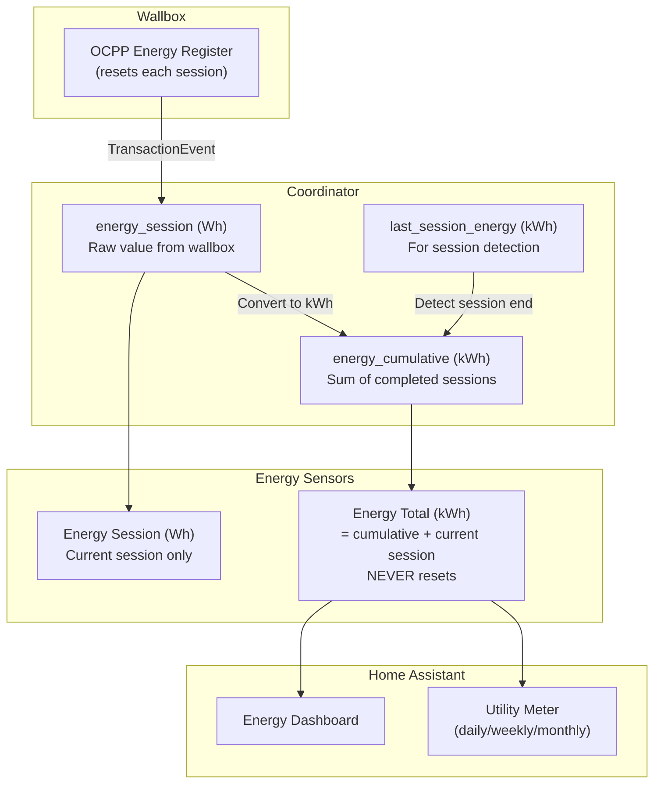
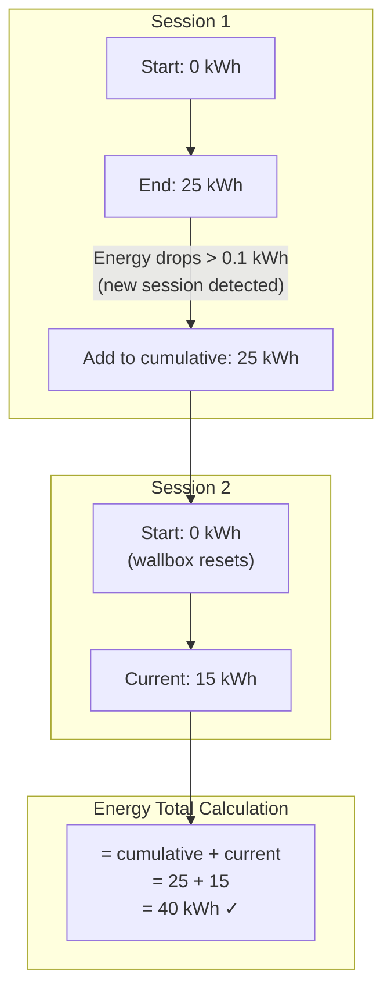
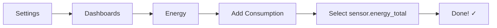
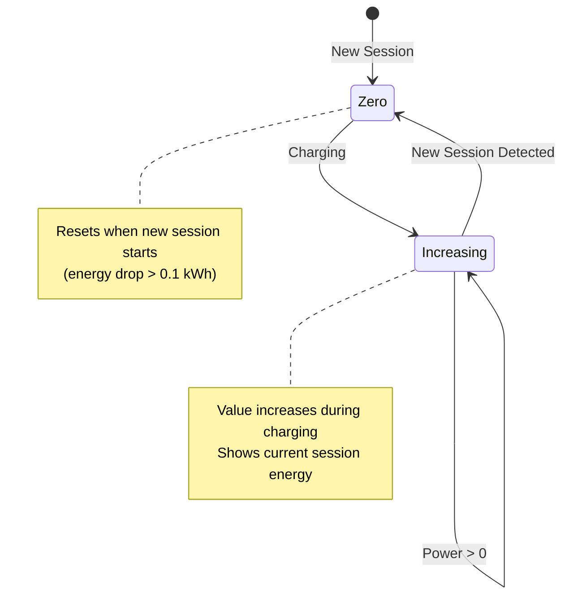
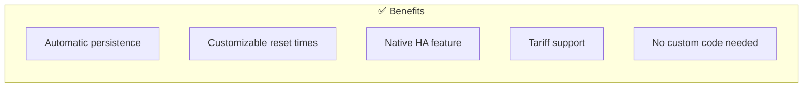
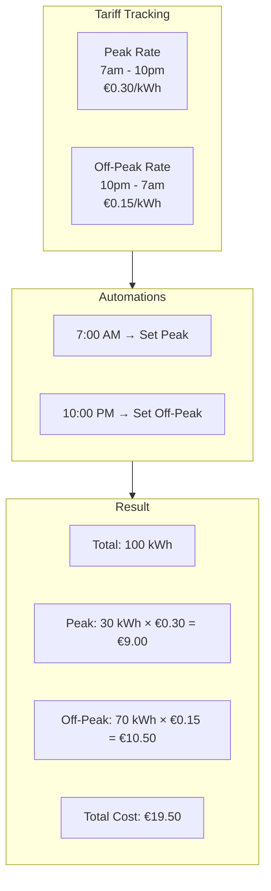
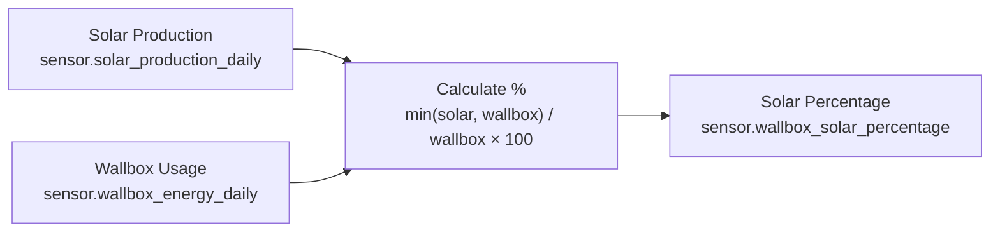
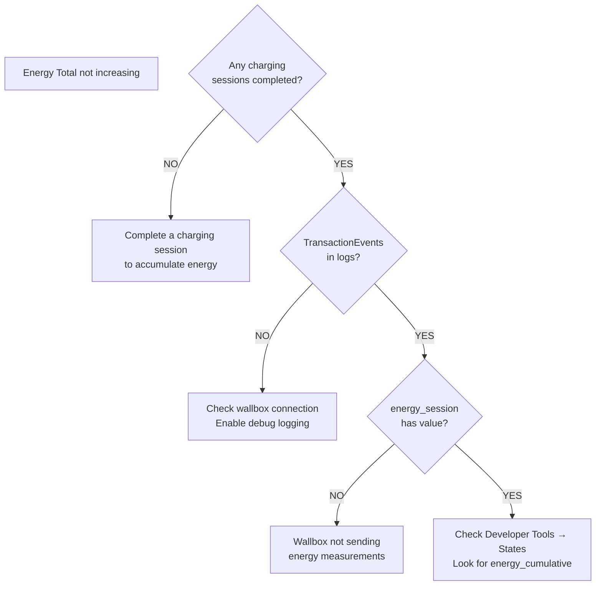
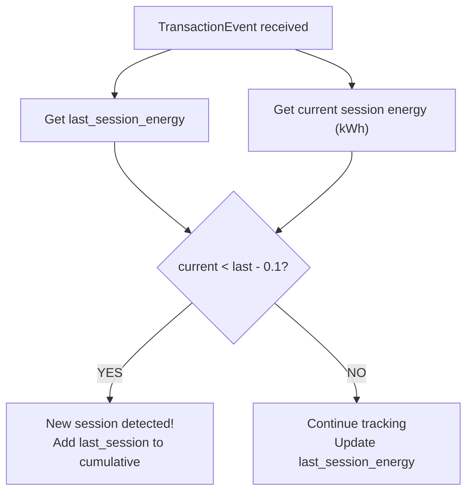

# BMW Wallbox Integration - Energy Sensors Guide

## Overview

The integration provides 2 core energy sensors:

| Sensor | Unit | Reset Behavior | Primary Use |
|--------|------|---------------|-------------|
| **Energy Total** | kWh | Never (cumulative) | Home Assistant Energy Dashboard |
| **Energy Session** | Wh | Per charging session | Current charge monitoring |

For period-based tracking (daily/weekly/monthly/yearly), use Home Assistant's built-in **Utility Meter** helper.

---

## Energy Flow Architecture



---

## Energy Total Sensor

### Purpose

**Main sensor for Home Assistant Energy Dashboard** - tracks lifetime cumulative energy consumption.

### Technical Details

- **Entity ID:** `sensor.energy_total`
- **Device Class:** `energy`
- **State Class:** `total_increasing`
- **Unit:** kWh
- **Precision:** 2 decimal places

### How It Works



1. **Cumulative Tracking**: Accumulates energy across ALL charging sessions
2. **Session Detection**: Monitors for energy drops > 0.1 kWh
3. **When Session Ends**: Adds last session's final value to cumulative total
4. **Calculation**: `energy_total = energy_cumulative + current_session_energy`

### Why This Matters

The wallbox's OCPP energy register (`Energy.Active.Import.Register`) resets to 0 at each charging session. This sensor solves that problem by maintaining a true cumulative total.

**Before Fix (Old Behavior):**
```
Session 1: 0 → 25 kWh → ends
Session 2: 0 → 15 kWh (total lost: 25 kWh!)
```

**After Fix (Current Behavior):**
```
Session 1: 0 → 25 kWh → ends → cumulative = 25 kWh
Session 2: 0 → 15 kWh → total shows 40 kWh ✓
```

### Energy Dashboard Setup



1. Go to **Settings** → **Dashboards** → **Energy**
2. Click **Add Consumption**
3. Select `sensor.energy_total`
4. Done! Energy will now be tracked correctly

---

## Energy Session Sensor

### Purpose

Track energy consumed in the **current charging session only**.

### Technical Details

- **Entity ID:** `sensor.bmw_wallbox_energy_session`
- **Device Class:** `energy`
- **State Class:** `total_increasing`
- **Unit:** Wh (not kWh, for precision)
- **Precision:** 0 decimal places

### Behavior



- Starts at 0 when charging begins
- Increases throughout the session
- Resets to 0 when a new session starts
- Useful for "how much did this charge cost?" calculations

### Example Automation

```yaml
automation:
  - alias: "Notify When Charge Complete"
    trigger:
      - platform: state
        entity_id: sensor.bmw_wallbox_state
        from: "Charging"
        to: "Ready"
    action:
      - service: notify.mobile_app
        data:
          message: >
            Charging complete! 
            Energy used: {{ states('sensor.bmw_wallbox_energy_session') }} Wh
            Cost: €{{ (states('sensor.bmw_wallbox_energy_session') | float / 1000 * 0.25) | round(2) }}
```

---

## Period-Based Energy Tracking

Use Home Assistant's **Utility Meter** helper for daily/weekly/monthly/yearly tracking.

### Why Utility Meter?



- ✅ **Automatic persistence** - survives Home Assistant restarts
- ✅ **Customizable reset times** - choose when periods reset
- ✅ **Native HA feature** - battle-tested and reliable
- ✅ **Tariff support** - track peak/off-peak separately
- ✅ **No integration code needed** - less complexity, fewer bugs

### Setup via UI (Recommended)

1. Go to **Settings** → **Devices & Services** → **Helpers**
2. Click **+ Create Helper** → **Utility Meter**
3. Configure:
   - **Name**: `Wallbox Energy Daily`
   - **Input sensor**: `sensor.energy_total`
   - **Meter reset cycle**: `Daily`
4. Click **Submit**

Repeat for Weekly, Monthly, and Yearly.

### Setup via YAML

```yaml
utility_meter:
  wallbox_energy_daily:
    source: sensor.energy_total
    cycle: daily
  wallbox_energy_weekly:
    source: sensor.energy_total
    cycle: weekly
  wallbox_energy_monthly:
    source: sensor.energy_total
    cycle: monthly
  wallbox_energy_yearly:
    source: sensor.energy_total
    cycle: yearly
```

---

## Advanced Use Cases

### Cost Tracking with Tariffs



```yaml
utility_meter:
  wallbox_energy_daily:
    source: sensor.energy_total
    cycle: daily
    tariffs:
      - peak
      - off_peak
```

Automate tariff switching:

```yaml
automation:
  - alias: "Set Peak Tariff (7am-10pm)"
    trigger:
      - platform: time
        at: "07:00:00"
    action:
      - service: utility_meter.select_tariff
        target:
          entity_id: utility_meter.wallbox_energy_daily
        data:
          tariff: peak

  - alias: "Set Off-Peak Tariff (10pm-7am)"
    trigger:
      - platform: time
        at: "22:00:00"
    action:
      - service: utility_meter.select_tariff
        target:
          entity_id: utility_meter.wallbox_energy_daily
        data:
          tariff: off_peak
```

### Monthly Cost Template

```yaml
template:
  - sensor:
      - name: "Wallbox Monthly Cost"
        unit_of_measurement: "EUR"
        state: >
          {{ (states('sensor.wallbox_energy_monthly') | float * 0.25) | round(2) }}
```

### Solar Charging Optimization



```yaml
template:
  - sensor:
      - name: "Wallbox Solar Percentage Today"
        unit_of_measurement: "%"
        state: >
          
          
          
            {{ (min(solar, wallbox) / wallbox * 100) | round(1) }}
          
            0
          
```

### Budget Alerts

```yaml
automation:
  - alias: "Monthly Energy Budget Alert"
    trigger:
      - platform: numeric_state
        entity_id: sensor.wallbox_energy_monthly
        above: 400  # kWh
    action:
      - service: notify.mobile_app
        data:
          message: >
            ⚠️ Monthly charging budget exceeded!
            Used: {{ states('sensor.wallbox_energy_monthly') }} kWh
```

### Statistics for Averages

```yaml
sensor:
  - platform: statistics
    name: "Wallbox Average Daily Energy"
    entity_id: sensor.wallbox_energy_daily
    state_characteristic: mean
    sampling_size: 30
    max_age:
      days: 30
```

---

## Troubleshooting

### Energy Total Not Increasing

**Symptoms:** Energy Total stays at 0 or doesn't increase



**Causes:**
1. No charging sessions completed yet
2. Wallbox not sending energy measurements

**Solution:**
- Check coordinator data in Developer Tools → States
- Look for `last_session_energy` and `energy_cumulative` attributes

### Session Detection Issues

**Symptoms:** Energy jumps unexpectedly or sessions not detected

**Causes:**
1. Energy values fluctuating around detection threshold
2. Wallbox sending unusual energy patterns

**Solution:**
- Detection threshold is 0.1 kWh to avoid false positives
- Check logs for "New session detected" messages

---

## Technical Implementation

### Session End Detection Logic



```python
# In coordinator.py on_transaction_event()
last_session = coordinator.data.get("last_session_energy", 0.0)
current_session = session_energy_kwh

if current_session < last_session - 0.1:  # Energy dropped
    # New session detected!
    coordinator.data["energy_cumulative"] += last_session
```

### Why We Use Utility Meter

Previously, the integration included custom daily/weekly/monthly/yearly sensors. These were removed because:

1. **Persistence issues** - Values reset on Home Assistant restart
2. **Complexity** - Required custom reset logic and state management
3. **Reliability** - Home Assistant's Utility Meter is battle-tested
4. **Flexibility** - Users can customize reset times and add tariffs

---

## Related Documentation

- [ENTITIES.md](ENTITIES.md) - Complete entity reference
- [DATA_SCHEMAS.md](DATA_SCHEMAS.md) - Data structure details
- [COORDINATOR.md](COORDINATOR.md) - Coordinator API reference
- [Home Assistant Energy Dashboard](https://www.home-assistant.io/docs/energy/)
- [Home Assistant Utility Meter](https://www.home-assistant.io/integrations/utility_meter/)
