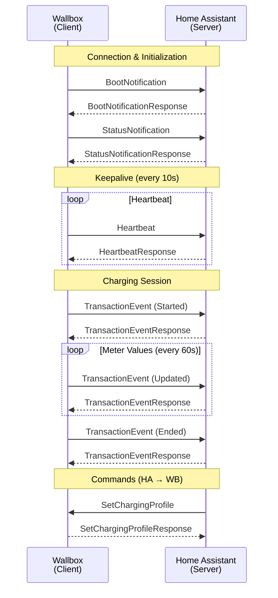
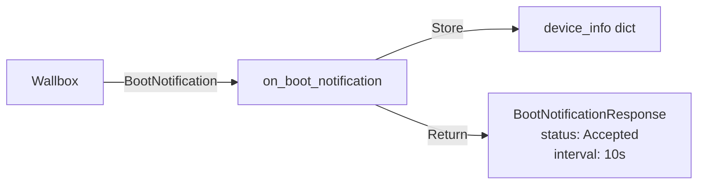
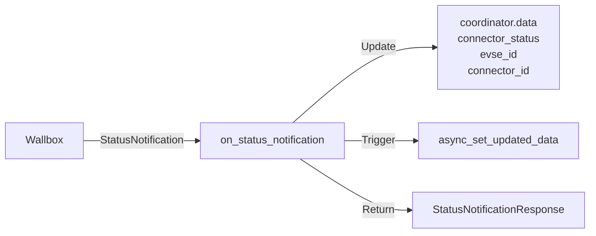
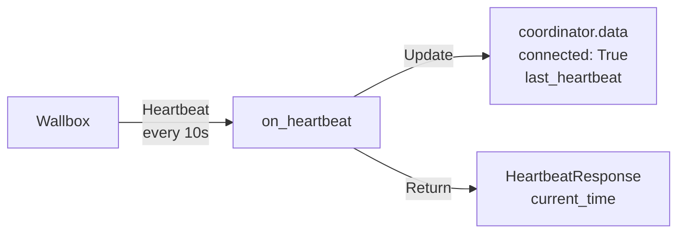
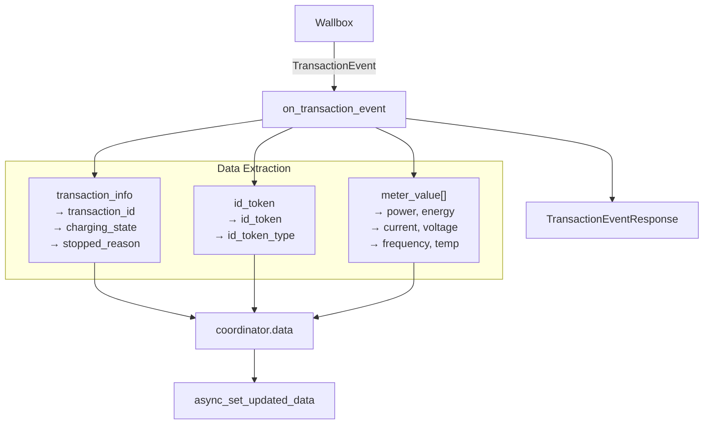
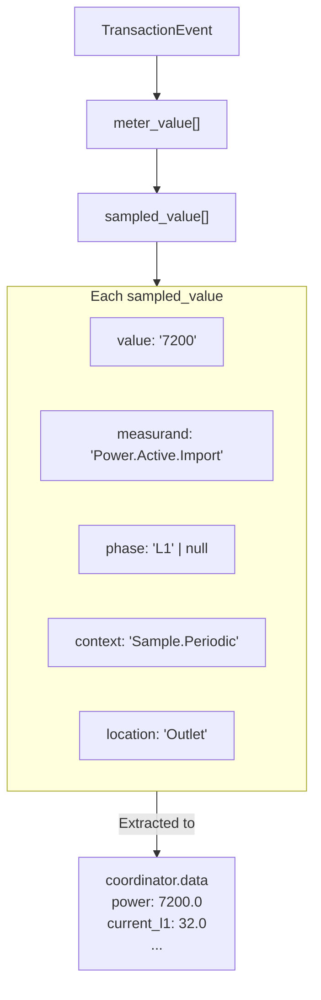
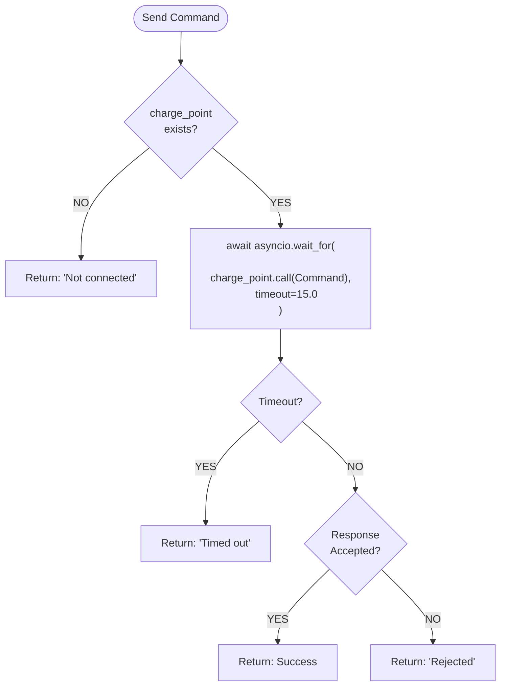
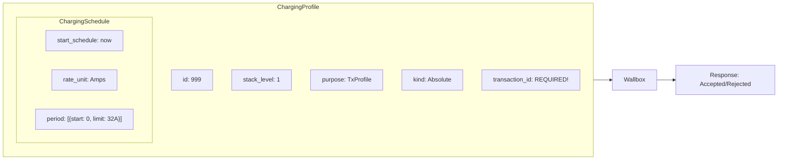
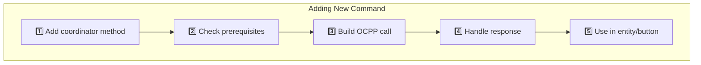

# BMW Wallbox Integration - OCPP Message Handlers

## Overview

The integration uses the `ocpp` Python library to handle OCPP 2.0.1 protocol messages. Message handlers are defined in the `WallboxChargePoint` class in `coordinator.py`.

```python
from ocpp.routing import on
from ocpp.v201 import ChargePoint as cp
from ocpp.v201 import call, call_result

class WallboxChargePoint(cp):
    """ChargePoint handler for the BMW wallbox."""
    
    @on("MessageName")
    async def on_message_name(self, param1, param2, **kwargs):
        # Handle incoming message
        return call_result.MessageName(...)
```

---

## Message Flow Overview



---

## Handler Decorator Pattern

The `@on("MessageName")` decorator from `ocpp.routing` registers a method as a handler for a specific OCPP message type.

```python
from ocpp.routing import on

@on("BootNotification")  # Message type to handle
async def on_boot_notification(
    self,
    charging_station,    # Required parameter from message
    reason,              # Required parameter from message
    **kwargs             # Catch any additional optional parameters
):
    # Process message
    # Return response
    return call_result.BootNotification(...)
```

### Key Rules

1. **Method name** can be anything, but convention is `on_{message_type_snake_case}`
2. **Parameters** must match OCPP spec (snake_case in Python)
3. **Always include `**kwargs`** to handle optional/unknown parameters
4. **Must return** appropriate `call_result.MessageType()`
5. **All handlers are async**

---

## Incoming Message Handlers

### BootNotification



**Purpose:** Wallbox announces itself when connecting or rebooting.

**Location:** `coordinator.py:59-77`

```python
@on("BootNotification")
async def on_boot_notification(self, charging_station, reason, **kwargs):
    """Handle BootNotification from wallbox."""
    _LOGGER.info("Boot Notification received from %s", self.id)
    _LOGGER.debug("Charging Station: %s", charging_station)
    
    # Store device info for entity device_info
    self.coordinator.device_info = {
        "model": charging_station.get("model", "Unknown"),
        "vendor": charging_station.get("vendor_name", "BMW"),
        "serial_number": charging_station.get("serial_number", "Unknown"),
        "firmware_version": charging_station.get("firmware_version", "Unknown"),
    }
    
    return call_result.BootNotification(
        current_time=datetime.utcnow().isoformat(),
        interval=10,  # Heartbeat interval in seconds
        status=RegistrationStatusEnumType.accepted,
    )
```

**Input Schema:**
```python
{
    "charging_station": {
        "model": str,
        "vendor_name": str,
        "serial_number": str,
        "firmware_version": str,
    },
    "reason": str,  # "PowerUp", "RemoteReset", etc.
}
```

**Response:** `BootNotificationResponse` with registration status

---

### StatusNotification



**Purpose:** Wallbox reports connector status changes.

**Location:** `coordinator.py:79-97`

```python
@on("StatusNotification")
async def on_status_notification(
    self, timestamp, connector_status, evse_id, connector_id, **kwargs
):
    """Handle StatusNotification."""
    _LOGGER.debug(
        "Status: EVSE=%s, Connector=%s, Status=%s",
        evse_id, connector_id, connector_status,
    )
    
    # Update coordinator data
    self.coordinator.data["connector_status"] = connector_status
    self.coordinator.data["evse_id"] = evse_id
    self.coordinator.data["connector_id"] = connector_id
    
    # Trigger entity updates
    self.coordinator.async_set_updated_data(self.coordinator.data)
    
    return call_result.StatusNotification()
```

**Input Schema:**
```python
{
    "timestamp": str,           # ISO 8601
    "connector_status": str,    # "Available", "Occupied", "Reserved", etc.
    "evse_id": int,
    "connector_id": int,
}
```

**Response:** Empty `StatusNotificationResponse`

---

### Heartbeat



**Purpose:** Connection keepalive, sent every N seconds.

**Location:** `coordinator.py:99-108`

```python
@on("Heartbeat")
async def on_heartbeat(self, **kwargs):
    """Handle Heartbeat from wallbox."""
    _LOGGER.debug("Heartbeat from %s", self.id)
    
    # Update connection status
    self.coordinator.data["connected"] = True
    self.coordinator.data["last_heartbeat"] = datetime.utcnow()
    
    return call_result.Heartbeat(current_time=datetime.utcnow().isoformat())
```

**Input Schema:** Empty (no parameters)

**Response:** `HeartbeatResponse` with current server time

---

### TransactionEvent



**Purpose:** Main data source - contains meter values and charging state. Sent periodically during charging.

**Location:** `coordinator.py:110-230`

```python
@on("TransactionEvent")
async def on_transaction_event(
    self,
    event_type,          # "Started", "Updated", "Ended"
    timestamp,           # ISO 8601
    trigger_reason,      # "Authorized", "MeterValuePeriodic", etc.
    seq_no,              # Sequence number
    transaction_info,    # Contains transaction_id, charging_state
    **kwargs,            # Contains id_token, meter_value, etc.
):
    """Handle TransactionEvent - contains all the sensor data!"""
    _LOGGER.debug(
        "Transaction Event: type=%s, reason=%s, seq=%s",
        event_type, trigger_reason, seq_no,
    )
    
    # Extract transaction ID
    self.current_transaction_id = transaction_info.get("transaction_id")
    self.coordinator.current_transaction_id = self.current_transaction_id
    
    # Update basic transaction info
    self.coordinator.data.update({
        "transaction_id": self.current_transaction_id,
        "charging_state": transaction_info.get("charging_state", "Unknown"),
        "event_type": event_type,
        "trigger_reason": trigger_reason,
        "sequence_number": seq_no,
        "last_update": timestamp,
        "stopped_reason": transaction_info.get("stopped_reason"),
    })
    
    # Extract ID token (RFID)
    id_token = kwargs.get("id_token", {})
    if id_token:
        self.coordinator.data["id_token"] = id_token.get("id_token")
        self.coordinator.data["id_token_type"] = id_token.get("type")
    
    # Extract meter values
    meter_value = kwargs.get("meter_value", [])
    if meter_value:
        for mv in meter_value:
            for sample in mv.get("sampled_value", []):
                self._process_sampled_value(sample)
    
    # Extract phases
    if "number_of_phases_used" in kwargs:
        self.coordinator.data["phases_used"] = kwargs["number_of_phases_used"]
    
    # Trigger entity updates
    self.coordinator.async_set_updated_data(self.coordinator.data)
    
    return call_result.TransactionEvent()
```

---

## Meter Value Extraction

Meter values are nested in `TransactionEvent.meter_value[].sampled_value[]`.



**Location:** `coordinator.py:150-221` (inside `on_transaction_event`)

```python
# Inside on_transaction_event:
meter_value = kwargs.get("meter_value", [])
if meter_value:
    for mv in meter_value:
        for sample in mv.get("sampled_value", []):
            measurand = sample.get("measurand")
            value = sample.get("value")
            phase = sample.get("phase")       # "L1", "L2", "L3", or None
            context = sample.get("context")   # "Sample.Periodic", etc.
            location = sample.get("location") # "Outlet", "Cable", "EV"
            
            # Power measurements
            if measurand == "Power.Active.Import":
                self.coordinator.data["power"] = float(value)
            
            # Energy measurements
            elif measurand == "Energy.Active.Import.Register":
                self.coordinator.data["energy_total"] = float(value) / 1000  # Wh to kWh
                self.coordinator.data["energy_session"] = float(value)
            
            # Current measurements (per phase)
            elif measurand == "Current.Import":
                if phase == "L1":
                    self.coordinator.data["current_l1"] = float(value)
                elif phase == "L2":
                    self.coordinator.data["current_l2"] = float(value)
                elif phase == "L3":
                    self.coordinator.data["current_l3"] = float(value)
                else:
                    self.coordinator.data["current"] = float(value)
            
            # Voltage measurements (per phase)
            elif measurand == "Voltage":
                if phase in ("L1", "L1-N"):
                    self.coordinator.data["voltage_l1"] = float(value)
                elif phase in ("L2", "L2-N"):
                    self.coordinator.data["voltage_l2"] = float(value)
                elif phase in ("L3", "L3-N"):
                    self.coordinator.data["voltage_l3"] = float(value)
                else:
                    self.coordinator.data["voltage"] = float(value)
            
            # Other measurements
            elif measurand == "Frequency":
                self.coordinator.data["frequency"] = float(value)
            elif measurand == "Temperature":
                self.coordinator.data["temperature"] = float(value)
            elif measurand == "SoC":
                self.coordinator.data["soc"] = float(value)
```

### Supported Measurands

| Measurand | Data Field | Unit | Notes |
|-----------|------------|------|-------|
| `Power.Active.Import` | `power` | W | Main power reading |
| `Power.Active.Export` | `power_active_export` | W | V2G export |
| `Power.Reactive.Import` | `power_reactive_import` | VAr | |
| `Power.Reactive.Export` | `power_reactive_export` | VAr | |
| `Power.Offered` | `power_offered` | W | Max available |
| `Power.Factor` | `power_factor` | 0-1 | |
| `Energy.Active.Import.Register` | `energy_total`, `energy_session` | Wh | Converted to kWh |
| `Energy.Active.Export.Register` | `energy_active_export` | Wh→kWh | |
| `Energy.Reactive.Import.Register` | `energy_reactive_import` | VArh→kVArh | |
| `Energy.Reactive.Export.Register` | `energy_reactive_export` | VArh→kVArh | |
| `Current.Import` | `current`, `current_l1/l2/l3` | A | Phase-dependent |
| `Voltage` | `voltage`, `voltage_l1/l2/l3` | V | Phase-dependent |
| `Frequency` | `frequency` | Hz | |
| `Temperature` | `temperature` | °C | |
| `SoC` | `soc` | % | State of Charge |

---

### NotifyReport

**Purpose:** Wallbox reports configuration data.

**Location:** `coordinator.py:232-236`

```python
@on("NotifyReport")
async def on_notify_report(self, request_id, seq_no, generated_at, report_data, **kwargs):
    """Handle NotifyReport - configuration data."""
    _LOGGER.debug("Notify Report: request_id=%s, seq=%s", request_id, seq_no)
    return call_result.NotifyReport()
```

---

## Sending Outgoing Commands

Commands are sent using the `call()` method of `WallboxChargePoint`.

### Pattern: Sending Commands with Timeout



```python
# coordinator.py - command pattern

async def async_some_command(self) -> dict:
    """Send command to wallbox."""
    result = {"success": False, "message": ""}
    
    # Check connection
    if not self.charge_point:
        result["message"] = "Wallbox not connected"
        return result
    
    try:
        # Send command with timeout
        response = await asyncio.wait_for(
            self.charge_point.call(
                call.CommandName(
                    param1=value1,
                    param2=value2,
                )
            ),
            timeout=15.0  # 15 second timeout
        )
        
        # Check response
        if response.status == ExpectedStatus.accepted:
            result["success"] = True
            result["message"] = "Command accepted"
        else:
            result["message"] = f"Rejected: {response.status}"
        
        return result
        
    except asyncio.TimeoutError:
        result["message"] = "Command timed out"
        _LOGGER.error("Command timed out!")
        return result
    except Exception as err:
        result["message"] = f"Error: {str(err)}"
        _LOGGER.error("Command failed: %s", err)
        return result
```

---

## Outgoing Command Reference

### RequestStartTransaction

**Purpose:** Start a new charging session.

**Location:** `coordinator.py:428-460`

```python
from ocpp.v201.datatypes import IdTokenType
from ocpp.v201.enums import IdTokenEnumType, RequestStartStopStatusEnumType

id_token = IdTokenType(
    id_token=self.config.get("rfid_token", "00000000000000"),
    type=IdTokenEnumType.local,
)

response = await asyncio.wait_for(
    self.charge_point.call(
        call.RequestStartTransaction(
            id_token=id_token,
            remote_start_id=int(datetime.utcnow().timestamp()),
            evse_id=1,
        )
    ),
    timeout=15.0
)

if response.status == RequestStartStopStatusEnumType.accepted:
    # Transaction started
    pass
```

---

### SetChargingProfile

**Purpose:** Control charging current. **REQUIRES active transaction.**



**Location:** `coordinator.py:624-648` (pause), `coordinator.py:698-722` (resume)

```python
from ocpp.v201.datatypes import (
    ChargingProfileType,
    ChargingScheduleType,
    ChargingSchedulePeriodType,
)
from ocpp.v201.enums import (
    ChargingProfileKindEnumType,
    ChargingProfilePurposeEnumType,
    ChargingRateUnitEnumType,
)

# Create schedule
schedule = ChargingScheduleType(
    id=1,
    start_schedule=datetime.utcnow().strftime("%Y-%m-%dT%H:%M:%SZ"),
    charging_rate_unit=ChargingRateUnitEnumType.amps,
    charging_schedule_period=[
        ChargingSchedulePeriodType(
            start_period=0,
            limit=32.0  # Amps (0 = pause, 32 = full)
        )
    ],
)

# Create profile
profile = ChargingProfileType(
    id=999,
    stack_level=1,
    charging_profile_purpose=ChargingProfilePurposeEnumType.tx_profile,
    charging_profile_kind=ChargingProfileKindEnumType.absolute,
    charging_schedule=[schedule],
    transaction_id=self.current_transaction_id,  # REQUIRED!
)

response = await asyncio.wait_for(
    self.charge_point.call(
        call.SetChargingProfile(evse_id=1, charging_profile=profile)
    ),
    timeout=15.0
)

if response.status == "Accepted":
    # Profile applied
    pass
```

**Critical:** `transaction_id` is REQUIRED for `tx_profile` purpose.

---

### SetVariables

**Purpose:** Configure wallbox settings (e.g., LED brightness).

**Location:** `coordinator.py:848-878`

```python
from ocpp.v201.datatypes import (
    SetVariableDataType,
    ComponentType,
    VariableType,
)
from ocpp.v201.enums import AttributeEnumType

set_var = SetVariableDataType(
    attribute_type=AttributeEnumType.actual,
    attribute_value=str(brightness),  # Value as string
    component=ComponentType(name="ChargingStation"),
    variable=VariableType(name="StatusLedBrightness"),
)

response = await asyncio.wait_for(
    self.charge_point.call(
        call.SetVariables(set_variable_data=[set_var])
    ),
    timeout=15.0
)

# Check result
if response.set_variable_result:
    result = response.set_variable_result[0]
    status = result.get("attribute_status", "Unknown")
    if status == "Accepted":
        # Setting applied
        pass
```

---

### Reset

**Purpose:** Reboot the wallbox.

**Location:** `coordinator.py:494-516`

```python
from ocpp.v201.enums import ResetEnumType, ResetStatusEnumType

response = await asyncio.wait_for(
    self.charge_point.call(
        call.Reset(type=ResetEnumType.immediate)
    ),
    timeout=15.0
)

if response.status == ResetStatusEnumType.accepted:
    # Wallbox will reboot (~60 seconds)
    self.data["connected"] = False
    self.current_transaction_id = None
```

---

## Template: Adding a New Handler

### Step 1: Define Handler Method

```python
# coordinator.py - in WallboxChargePoint class

@on("NewMessageType")
async def on_new_message_type(
    self,
    required_param1,
    required_param2,
    **kwargs,
):
    """Handle NewMessageType from wallbox."""
    _LOGGER.debug("NewMessageType received: %s, %s", required_param1, required_param2)
    
    # Extract data and update coordinator
    self.coordinator.data["new_field"] = required_param1
    
    # Trigger entity updates
    self.coordinator.async_set_updated_data(self.coordinator.data)
    
    # Return response
    return call_result.NewMessageType(
        response_param="value",
    )
```

### Step 2: Add Data Field

```python
# coordinator.py - in BMWWallboxCoordinator.__init__()
self.data: dict[str, Any] = {
    # ... existing fields ...
    "new_field": None,  # Default value
}
```

### Step 3: Create Entity (if needed)

See `ENTITIES.md` for entity templates.

---

## Template: Adding a New Outgoing Command



### Step 1: Add Coordinator Method

```python
# coordinator.py - in BMWWallboxCoordinator class

async def async_new_command(self, param: int) -> dict:
    """Send new command to wallbox."""
    result = {"success": False, "message": ""}
    
    if not self.charge_point:
        result["message"] = "Wallbox not connected"
        return result
    
    _LOGGER.info("Sending NewCommand with param=%s", param)
    
    try:
        response = await asyncio.wait_for(
            self.charge_point.call(
                call.NewCommand(
                    param=param,
                )
            ),
            timeout=15.0
        )
        
        if response.status == "Accepted":
            result["success"] = True
            result["message"] = "Command accepted"
        else:
            result["message"] = f"Rejected: {response.status}"
        
        return result
        
    except asyncio.TimeoutError:
        result["message"] = "Command timed out"
        return result
    except Exception as err:
        result["message"] = f"Error: {str(err)}"
        _LOGGER.error("NewCommand failed: %s", err)
        return result
```

### Step 2: Use in Entity/Button

```python
# In button or other entity
await self.coordinator.async_new_command(value)
```

---

## Debugging OCPP Messages

Enable debug logging:

```yaml
# configuration.yaml
logger:
  default: info
  logs:
    custom_components.bmw_wallbox: debug
    ocpp: debug
    websockets: debug
```

This will log all OCPP messages in both directions.
