# BMW Wallbox Integration - Code Patterns & Anti-Patterns

## Decision Trees

### Decision Tree: Start Charging


**Implementation:** `coordinator.py:async_start_charging()` (lines 616-805)

**💣 NUKE Option:** If all start methods fail and `allow_nuke=True` (default), the wallbox
is rebooted as a last resort. Charging auto-starts after reboot (~60 seconds).

---

### Decision Tree: Stop/Pause Charging

```mermaid
flowchart TD
    Start([User requests<br/>STOP CHARGING])
    
    CheckConn{Is wallbox<br/>connected?}
    FailNotConn["❌ FAIL"]
    
    CheckTx{Has transaction_id?}
    FailNoTx["❌ FAIL<br/>'No tx'"]
    
    CheckPower{Is power<br/>already 0?}
    SuccessAlready["✅ SUCCESS<br/>'already paused'"]
    
    Pause["Use SetChargingProfile(0A)<br/><br/>PAUSES charging<br/>Keeps tx alive"]
    
    Start --> CheckConn
    CheckConn -->|NO| FailNotConn
    CheckConn -->|YES| CheckTx
    CheckTx -->|NO| FailNoTx
    CheckTx -->|YES| CheckPower
    CheckPower -->|YES| SuccessAlready
    CheckPower -->|NO| Pause
```



**Implementation:** `coordinator.py:async_pause_charging()` (lines 589-669)

---

### Decision Tree: Set Current Limit

```mermaid
flowchart TD
    Start([User requests<br/>SET CURRENT LIMIT])
    
    CheckConn{Is wallbox<br/>connected?}
    FailNotConn["❌ FAIL"]
    
    CheckTx{Has transaction_id?<br/>REQUIRED for tx_profile}
    FailNoTx["❌ FAIL<br/>'No tx - start first'"]
    
    SetProfile["Send SetChargingProfile<br/>with specified limit<br/><br/>0A = pause<br/>32A = full"]
    
    Start --> CheckConn
    CheckConn -->|NO| FailNotConn
    CheckConn -->|YES| CheckTx
    CheckTx -->|NO| FailNoTx
    CheckTx -->|YES| SetProfile
```



**Implementation:** `coordinator.py:async_set_current_limit()` (lines 759-832)

---

## Code Patterns

### Pattern: Reading Coordinator Data in Entities

**Always read from `self.coordinator.data`, never store state in entities.**

```python
# ✅ CORRECT: Read from coordinator
class BMWWallboxPowerSensor(BMWWallboxSensorBase):
    @property
    def native_value(self) -> float | None:
        return self.coordinator.data.get("power")

# ❌ WRONG: Store state in entity
class BMWWallboxPowerSensor(BMWWallboxSensorBase):
    def __init__(self, ...):
        self._power = 0  # DON'T DO THIS
    
    @property
    def native_value(self) -> float | None:
        return self._power  # DON'T DO THIS
```

**Why:** CoordinatorEntity pattern ensures all entities update together when coordinator data changes.

---

### Pattern: Sending OCPP Commands with Timeout

**Always wrap `call()` in `asyncio.wait_for()` with 15 second timeout.**

```python
# ✅ CORRECT: With timeout
try:
    response = await asyncio.wait_for(
        self.charge_point.call(
            call.SetChargingProfile(evse_id=1, charging_profile=profile)
        ),
        timeout=15.0
    )
except asyncio.TimeoutError:
    _LOGGER.error("Command timed out!")
    return False

# ❌ WRONG: No timeout (can hang forever)
response = await self.charge_point.call(
    call.SetChargingProfile(evse_id=1, charging_profile=profile)
)
```

---

### Pattern: Updating Coordinator Data

**After modifying `coordinator.data`, call `async_set_updated_data()` to trigger entity updates.**

```python
# In OCPP handler (WallboxChargePoint)
self.coordinator.data["power"] = float(value)
self.coordinator.data["current"] = float(current_value)
# Trigger update AFTER all changes
self.coordinator.async_set_updated_data(self.coordinator.data)
```

---

### Pattern: Checking Prerequisites

**Always check connection and transaction state before sending commands.**

```python
async def async_some_command(self) -> dict:
    result = {"success": False, "message": ""}
    
    # Check 1: Wallbox connected?
    if not self.charge_point:
        result["message"] = "Wallbox not connected"
        _LOGGER.error("Cannot execute: no wallbox connected")
        return result
    
    # Check 2: Transaction active? (if required)
    if not self.current_transaction_id:
        result["message"] = "No active charging session"
        _LOGGER.error("Cannot execute: no transaction")
        return result
    
    # Now safe to send command...
```

---

### Pattern: Error Handling in Coordinator Methods

**Return result dict with success/message for user feedback.**

```python
async def async_command(self) -> dict:
    result = {
        "success": False,
        "message": "",
        "action": "failed",
    }
    
    try:
        response = await asyncio.wait_for(
            self.charge_point.call(call.Command(...)),
            timeout=15.0
        )
        
        if response.status == "Accepted":
            result["success"] = True
            result["message"] = "Command accepted"
            result["action"] = "completed"
        else:
            result["message"] = f"Rejected: {response.status}"
            result["action"] = "rejected"
        
        return result
        
    except asyncio.TimeoutError:
        result["message"] = "Command timed out"
        _LOGGER.error("Command timed out!")
        return result
    except Exception as err:
        result["message"] = f"Error: {str(err)}"
        _LOGGER.error("Command failed: %s", err)
        return result
```

---

### Pattern: Button with Loading State

**Use `_async_press_with_loading()` for visual feedback.**

```python
class BMWWallboxSomeButton(BMWWallboxButtonBase):
    async def async_press(self) -> None:
        await self._async_press_with_loading(self._do_action())
    
    async def _do_action(self) -> None:
        result = await self.coordinator.async_some_command()
        if result["success"]:
            _LOGGER.info("Action successful")
        else:
            _LOGGER.warning("Action failed: %s", result["message"])
```

This pattern:
1. Sets `_is_processing = True` (shows loading icon)
2. Executes the action
3. Ensures minimum 1.5s loading time for UX
4. Sets `_is_processing = False`

---

### Pattern: Entity Availability Based on State

**Override `available` property to disable entity when not usable.**

```python
class BMWWallboxCurrentLimitNumber(CoordinatorEntity, NumberEntity):
    @property
    def available(self) -> bool:
        """Current limit only works with active transaction."""
        return (
            super().available  # Base availability (coordinator available)
            and self.coordinator.data.get("connected", False)
            and self.coordinator.current_transaction_id is not None
        )
```

---

### Pattern: Device Info (Required on All Entities)

**Every entity must include `device_info` for proper grouping.**

```python
self._attr_device_info = {
    "identifiers": {(DOMAIN, entry.data["charge_point_id"])},
    "name": "BMW Wallbox",
    "manufacturer": coordinator.device_info.get("vendor", "BMW"),
    "model": coordinator.device_info.get("model", "EIAW-E22KTSE6B04"),
    "sw_version": coordinator.device_info.get("firmware_version"),
    "serial_number": coordinator.device_info.get("serial_number"),
}
```

---

## Anti-Patterns

### Anti-Pattern: Using RequestStopTransaction

**DO NOT use `RequestStopTransaction` to stop charging.**

```python
# ❌ WRONG: Causes stuck transaction states
response = await self.charge_point.call(
    call.RequestStopTransaction(
        transaction_id=self.current_transaction_id
    )
)
# After this, wallbox enters "Finishing" state - cannot restart!

# ✅ CORRECT: Use SetChargingProfile(0A) to pause
await self.async_pause_charging()
# Transaction stays alive, can resume instantly with SetChargingProfile(32A)
```

**Why it's bad (OCPP Standard limitation):**

According to the OCPP specification, after `RequestStopTransaction`, the charger enters
"Finishing" state. From this state, **it is not allowed to start a new transaction with
an IdTag**. This is defined by the OCPP standard and affects all compliant chargers.

The only recovery options are:
1. Unplug and replug the cable
2. Reboot the wallbox (💣 NUKE option)

Source: [Teltonika Community Discussion](https://community.teltonika.lt/t/re-starting-charging-via-ocpp-fails/13750/2)

**The EVCC-style solution:**
- Use `SetChargingProfile(0A)` to pause (current = 0, transaction alive)
- Use `SetChargingProfile(32A)` to resume (instant, no stuck states)
- Only use `RequestStopTransaction` if you want to fully end the session

---

### Anti-Pattern: SetChargingProfile Without Transaction ID

**DO NOT send SetChargingProfile without an active transaction.**

```python
# ❌ WRONG: Will be rejected
profile = ChargingProfileType(
    id=999,
    stack_level=1,
    charging_profile_purpose=ChargingProfilePurposeEnumType.tx_profile,
    charging_profile_kind=ChargingProfileKindEnumType.absolute,
    charging_schedule=[schedule],
    # Missing transaction_id!
)

# ✅ CORRECT: Include transaction_id
profile = ChargingProfileType(
    id=999,
    stack_level=1,
    charging_profile_purpose=ChargingProfilePurposeEnumType.tx_profile,
    charging_profile_kind=ChargingProfileKindEnumType.absolute,
    charging_schedule=[schedule],
    transaction_id=self.current_transaction_id,  # Required!
)
```

---

### Anti-Pattern: Storing State in Entities

**DO NOT store mutable state in entity instances.**

```python
# ❌ WRONG: State in entity
class BMWWallboxPowerSensor(BMWWallboxSensorBase):
    def __init__(self, ...):
        self._last_power = 0
        self._power_history = []
    
    def update_power(self, value):
        self._last_power = value  # Don't do this
        self._power_history.append(value)  # Don't do this

# ✅ CORRECT: All state in coordinator.data
class BMWWallboxPowerSensor(BMWWallboxSensorBase):
    @property
    def native_value(self) -> float | None:
        return self.coordinator.data.get("power")
```

**Why it's bad:**
- Entities may be recreated
- State gets out of sync
- Harder to debug

---

### Anti-Pattern: Blocking Calls in Async Methods

**DO NOT use blocking operations in async methods.**

```python
# ❌ WRONG: Blocking call
async def async_some_method(self):
    import time
    time.sleep(5)  # Blocks the event loop!
    
# ✅ CORRECT: Async sleep
async def async_some_method(self):
    await asyncio.sleep(5)  # Non-blocking
```

---

### Anti-Pattern: Missing Timeout on OCPP Calls

**DO NOT send OCPP commands without timeout.**

```python
# ❌ WRONG: No timeout (can hang indefinitely)
response = await self.charge_point.call(call.Command(...))

# ✅ CORRECT: Always use timeout
response = await asyncio.wait_for(
    self.charge_point.call(call.Command(...)),
    timeout=15.0
)
```

---

### Anti-Pattern: Ignoring Command Failures

**DO NOT ignore failure responses.**

```python
# ❌ WRONG: Ignores result
await self.charge_point.call(call.SetChargingProfile(...))
# What if it was rejected?

# ✅ CORRECT: Check result
response = await asyncio.wait_for(
    self.charge_point.call(call.SetChargingProfile(...)),
    timeout=15.0
)
if response.status != "Accepted":
    _LOGGER.warning("Command rejected: %s", response.status)
    return False
```

---

### Anti-Pattern: Hardcoded Magic Values

**DO NOT use magic numbers/strings directly in code.**

```python
# ❌ WRONG: Magic values
self._attr_unique_id = f"{entry.entry_id}_power"  # "power" is magic string

# ✅ CORRECT: Use constants
from .const import SENSOR_POWER
self._attr_unique_id = f"{entry.entry_id}_{SENSOR_POWER}"
```

---

## Summary: Key Rules

```mermaid
flowchart LR
    subgraph Rules["🔑 Key Rules"]
        R1["1️⃣ Check charge_point<br/>before commands"]
        R2["2️⃣ Check transaction_id<br/>before SetChargingProfile"]
        R3["3️⃣ Always use timeout<br/>15s on OCPP calls"]
        R4["4️⃣ Update via<br/>coordinator.data"]
        R5["5️⃣ Never use<br/>RequestStopTransaction<br/>to pause"]
        R6["6️⃣ Never block in<br/>async methods"]
        R7["7️⃣ Include device_info<br/>on all entities"]
        R8["8️⃣ Use constants<br/>from const.py"]
        R9["9️⃣ 💣 NUKE is<br/>last resort"]
    end
```



1. **Always check `charge_point` before commands** - wallbox may be disconnected
2. **Always check `current_transaction_id` before SetChargingProfile** - it's required
3. **Always use timeout (15s) on OCPP calls** - prevent hangs
4. **Always update via `coordinator.data`** - single source of truth
5. **Never use RequestStopTransaction to pause** - use SetChargingProfile(0A) instead (avoids OCPP Finishing state)
6. **Never block in async methods** - use `await asyncio.sleep()` not `time.sleep()`
7. **Always include `device_info`** - required for HA device grouping
8. **Always use constants from `const.py`** - no magic strings
9. **💣 NUKE is the last resort** - if all start methods fail, wallbox reboot works but takes ~60s
