# BMW Wallbox Integration - Developer Troubleshooting

## Enable Debug Logging

Add to `configuration.yaml`:

```yaml
logger:
  default: info
  logs:
    custom_components.bmw_wallbox: debug
    ocpp: debug
    websockets: debug
```

After adding, restart Home Assistant.

### View Logs

**Home Assistant UI:**
Settings → System → Logs

**Command line (Docker):**
```bash
docker logs homeassistant -f | grep bmw_wallbox
```

**Command line (Core):**
```bash
tail -f /config/home-assistant.log | grep bmw_wallbox
```

---

## Quick Diagnostic Flowchart


---

## Common Issues

### Issue: Entity Not Appearing in Home Assistant

**Symptoms:**
- Entity missing from entity list
- Device shows in devices but missing entities

**Causes & Solutions:**

1. **Entity not registered in `async_setup_entry()`**
   ```python
   # Check sensor.py (or appropriate platform file)
   async def async_setup_entry(...):
       async_add_entities([
           # Is your entity in this list?
           BMWWallboxNewSensor(coordinator, entry),  # ← Must be here
       ])
   ```

2. **Missing unique_id**
   ```python
   # Every entity needs a unique ID
   self._attr_unique_id = f"{entry.entry_id}_{SENSOR_SUFFIX}"
   ```

3. **Platform not registered in `__init__.py`**
   ```python
   # Check PLATFORMS list
   PLATFORMS: list[Platform] = [
       Platform.SENSOR,
       Platform.BINARY_SENSOR,
       # Is your platform type here?
   ]
   ```

4. **Exception during entity initialization**
   - Check logs for errors during setup
   - Entity `__init__` should not fail

---

### Issue: Coordinator Data Not Updating

**Symptoms:**
- Sensors show stale/old values
- New OCPP messages not reflected in entities

**Causes & Solutions:**

1. **Missing `async_set_updated_data()` call**
   ```python
   # In OCPP handler, after updating data:
   self.coordinator.data["power"] = new_value
   self.coordinator.async_set_updated_data(self.coordinator.data)  # ← Required!
   ```

2. **Entity not reading from coordinator.data**
   ```python
   # WRONG: Reading from instance variable
   return self._power
   
   # CORRECT: Reading from coordinator
   return self.coordinator.data.get("power")
   ```

3. **Wallbox not sending TransactionEvent**
   - Check if transaction is active
   - Verify wallbox is actually charging
   - Check OCPP debug logs for incoming messages

---

### Issue: OCPP Command Rejected

**Symptoms:**
- Log shows "Rejected" status
- Command has no effect on wallbox

**Causes & Solutions:**


1. **SetChargingProfile without transaction**
   ```python
   # SetChargingProfile requires active transaction
   if not self.current_transaction_id:
       _LOGGER.error("Cannot set profile - no transaction!")
       return False
   
   # Include transaction_id in profile
   profile = ChargingProfileType(
       ...
       transaction_id=self.current_transaction_id,  # ← Required!
   )
   ```

2. **Wrong EVSE ID**
   ```python
   # BMW wallbox typically uses evse_id=1
   call.SetChargingProfile(evse_id=1, ...)  # ← Check this
   ```

3. **Invalid current limit**
   - Value must be within wallbox limits (typically 0-32A)
   - Check wallbox capabilities

4. **Wallbox in wrong state**
   - Some commands only work in specific states
   - Check `connector_status` and `charging_state`

---

### Issue: SSL/WebSocket Connection Failed

**Symptoms:**
- Wallbox doesn't connect
- Log shows SSL errors
- "Failed to start OCPP server"


**Causes & Solutions:**

1. **Certificate file not found**
   ```python
   # Check paths exist
   if not os.path.isfile(data[CONF_SSL_CERT]):
       raise InvalidSSLCert(f"Not found: {data[CONF_SSL_CERT]}")
   ```
   
   **Solution:** Verify certificate paths in config:
   - Default: `/ssl/fullchain.pem`, `/ssl/privkey.pem`
   - Must be readable by Home Assistant

2. **Certificate format issues**
   - Must be PEM format
   - Check certificate chain is complete
   - Private key must match certificate

3. **Port already in use**
   ```
   Error: [Errno 98] Address already in use
   ```
   **Solution:** Change port in integration config or stop conflicting service

4. **Firewall blocking connection**
   - Ensure port 9000 (or configured port) is accessible
   - Check router/firewall rules
   - Wallbox must be able to reach Home Assistant IP

5. **Wrong OCPP URL on wallbox**
   ```
   Correct: wss://homeassistant-ip:9000/CHARGE_POINT_ID
   ```
   - Protocol must be `wss://` (secure WebSocket)
   - Port must match config
   - Path must be the charge point ID

---

### Issue: Stuck Transaction / Cannot Start Charging

**Symptoms:**
- "Transaction already exists" error
- Start button doesn't work
- Wallbox shows connected but won't charge
- `RequestStartTransaction` rejected after stopping

```mermaid
flowchart TD
    Stuck([Cannot Start<br/>Charging])
    
    Stuck --> WasStop{Used<br/>RequestStop-<br/>Transaction?}
    WasStop -->|YES| OCPP["OCPP 'Finishing' state!<br/>Cannot restart with IdTag"]
    OCPP --> Recovery{Recovery<br/>Options}
    Recovery --> Opt1["Option 1: Unplug/replug cable"]
    Recovery --> Opt2["Option 2: 💣 NUKE - Reboot wallbox"]
    Recovery --> Opt3["Option 3: Wait for auto-start"]
    
    WasStop -->|NO| CheckConn{Wallbox<br/>connected?}
    CheckConn -->|NO| WaitConn["Wait for<br/>wallbox connection"]
    CheckConn -->|YES| CheckCable{Cable<br/>plugged in?}
    CheckCable -->|NO| PlugCable["Plug in<br/>charging cable"]
    CheckCable -->|YES| TryNuke["Try 💣 NUKE option<br/>in async_start_charging()"]
```



**Root Cause: OCPP "Finishing" State**

According to the OCPP standard, after `RequestStopTransaction`, the charger enters "Finishing" state. From this state, **it is not allowed to start a new transaction with an IdTag**. This is defined by the OCPP specification and affects all compliant chargers.

Source: [Teltonika Community Discussion](https://community.teltonika.lt/t/re-starting-charging-via-ocpp-fails/13750/2)

**Solutions:**

1. **Use SetChargingProfile instead of Stop (Recommended)**
   - This integration uses `SetChargingProfile(0A)` to pause
   - Transaction stays active, avoids Finishing state
   - Resume with `SetChargingProfile(32A)`
   
2. **💣 NUKE Option (Automatic)**
   - If all start methods fail, the integration automatically reboots the wallbox
   - Takes ~60 seconds, charging auto-starts after reboot
   - Enabled by default, can be disabled with `allow_nuke=False`
   - Look for `💣 NUKE OPTION` in logs

3. **Manual Recovery: Reset wallbox**
   ```python
   await coordinator.async_reset_wallbox()
   # Wait ~60 seconds for reboot
   ```
   
4. **Manual Recovery: Unplug and replug cable**
   - Physically disconnect charging cable
   - Wait 10 seconds
   - Reconnect cable
   - New transaction should auto-start

**Prevention:**
- Always use the Stop button (which uses `SetChargingProfile(0A)`)
- Avoid directly calling `RequestStopTransaction`
- See `PATTERNS.md` for correct approach

---

### Issue: Command Timeout

**Symptoms:**
- "Command timed out" in logs
- Actions hang for 15 seconds then fail

**Causes & Solutions:**

1. **Wallbox not responding**
   - Check wallbox is powered on
   - Check network connectivity
   - Verify OCPP connection (heartbeat logs)

2. **WebSocket connection dropped**
   - Check `connected` status in coordinator
   - Look for WebSocket errors in logs
   - May need to wait for auto-reconnect

3. **Timeout too short**
   ```python
   # Default is 15 seconds
   response = await asyncio.wait_for(
       self.charge_point.call(...),
       timeout=15.0  # Increase if needed
   )
   ```

---

### Issue: Import Errors

**Symptoms:**
- "ModuleNotFoundError" in logs
- Integration fails to load

**Causes & Solutions:**

1. **Missing dependency**
   ```json
   // Check manifest.json
   "requirements": [
       "ocpp>=0.20.0"  // Must be installed
   ]
   ```
   
   **Solution:** Restart Home Assistant to install dependencies

2. **Circular import**
   - Check import order
   - Use local imports if needed:
   ```python
   def some_function():
       from .coordinator import BMWWallboxCoordinator  # Local import
   ```

3. **Wrong import path**
   ```python
   # WRONG
   from bmw_wallbox.const import DOMAIN
   
   # CORRECT
   from .const import DOMAIN
   ```

---

## Debugging Techniques

### Print Coordinator Data

Add temporary logging to see all data:

```python
# In any entity or handler
import json
_LOGGER.debug("Coordinator data: %s", json.dumps(self.coordinator.data, default=str))
```

### Check OCPP Message Flow

Enable ocpp library logging:

```yaml
logger:
  logs:
    ocpp: debug
```

This shows all incoming/outgoing OCPP messages.

### Test OCPP Commands Manually

Create a simple script to test:

```python
import asyncio
from ocpp.v201 import call

async def test_command():
    # ... setup charge_point ...
    response = await charge_point.call(
        call.SetChargingProfile(...)
    )
    print(f"Response: {response}")

asyncio.run(test_command())
```

### Verify Entity Registration

Check if entity is in Home Assistant:

```python
# In __init__.py after platform setup
_LOGGER.info("Registered entities: %s", 
    [e.entity_id for e in hass.states.async_all()])
```

---

### Issue: SetChargingProfile(0A) Causes Transaction to End

**Symptoms:**
- Pressing Stop works, but can't restart
- Car shows charging stopped
- Transaction ID cleared

**Root Cause:**
When `SetChargingProfile(0A)` is sent, the car sees 0A available and stops requesting power. If the wallbox has `StopTxOnEVSideDisconnect` enabled (default), it ends the transaction automatically.

**Solution:**
On wallbox connect, the integration tries to set `StopTxOnEVSideDisconnect=false`. Check logs for:
```
🔧 Configuring wallbox for pause/resume support...
StopTxOnEVSideDisconnect configuration: Accepted
✅ Wallbox configured for pause/resume!
```

If this configuration fails, the car may still end sessions when paused.

---

## Common Error Messages

### "Wallbox not connected"

**Meaning:** `self.charge_point` is None

**Causes:**
- Wallbox hasn't connected yet
- WebSocket connection dropped
- SSL handshake failed

**Solution:** Check network, SSL config, wait for reconnection

---

### "No active charging session"

**Meaning:** `self.current_transaction_id` is None

**Causes:**
- No transaction started
- Transaction ended (cable unplugged)
- Transaction stuck on wallbox

**Solution:** Start new transaction with `async_start_charging()`

---

### "Failed to start OCPP server"

**Meaning:** WebSocket server failed to bind

**Causes:**
- Port in use
- SSL certificate issues
- Permission denied

**Solution:** Check port, certificates, permissions

---

### "SetChargingProfile rejected"

**Meaning:** Wallbox rejected the charging profile

**Causes:**
- No active transaction
- Invalid current value
- Wrong profile format

**Solution:** Ensure transaction exists, check current limits

---

## Getting Help

1. **Check existing logs** - Most issues visible in debug logs
2. **Review this documentation** - Patterns and anti-patterns
3. **Check Home Assistant logs** - Look for integration errors
4. **Verify OCPP messages** - Enable ocpp debug logging
5. **Test wallbox directly** - Use OCPP testing tools if available

---

## Quick Diagnostic Checklist

```mermaid
flowchart LR
    subgraph Checklist["🔍 Diagnostic Checklist"]
        C1["☐ Debug logging enabled?"]
        C2["☐ SSL certs exist & readable?"]
        C3["☐ Port accessible from wallbox?"]
        C4["☐ Wallbox OCPP URL correct?"]
        C5["☐ WebSocket connected? (heartbeats)"]
        C6["☐ Transaction active?"]
        C7["☐ Entity registered?"]
        C8["☐ Entity has unique_id?"]
        C9["☐ async_set_updated_data called?"]
    end
```



- [ ] Debug logging enabled?
- [ ] SSL certificates exist and readable?
- [ ] Port accessible from wallbox?
- [ ] Wallbox configured with correct OCPP URL?
- [ ] WebSocket connection established (check heartbeats)?
- [ ] Transaction active (for SetChargingProfile)?
- [ ] Entity registered in `async_setup_entry()`?
- [ ] Entity has unique_id?
- [ ] `async_set_updated_data()` called after data changes?
